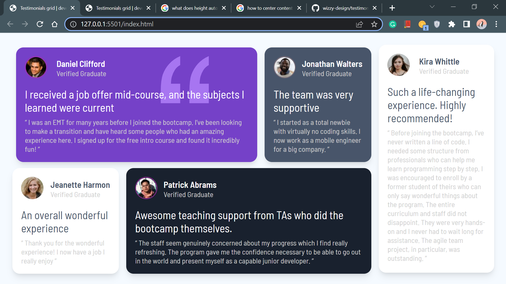

# Frontend Mentor - Testimonials grid section solution

This is a solution to the [Testimonials grid section challenge on Frontend Mentor](https://www.frontendmentor.io/challenges/testimonials-grid-section-Nnw6J7Un7). Frontend Mentor challenges help you improve your coding skills by building realistic projects. 

## Table of contents

- [Screenshot](#screenshot)
- [Built with](#built-with)
- [Author](#author)

### Link

- Live URL: [Testimonial site](https://wizzy-design.github.io/testimonials-grid-section-main/)

### Screenshot

### Built with

- Semantic HTML5 markup
- CSS custom properties
- Flexbox

## Author

- Website - [Wisdom Ochei](https://wizzy-design.github.io/wisdom_portfolio/)
- Twitter - [@WisdomOchei](https://www.twitter.com/WisdomOchei)
